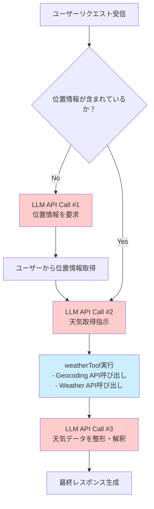

# Paper RAG

Mastraフレームワークを使用したAIエージェントとワークフロープロジェクト。

## 概要

このプロジェクトは、天気情報取得やQiitaの投稿要約などのAIエージェント機能を提供します。

## Weather Agent LLM API呼び出しフロー



### LLM API呼び出し回数

- **最小ケース（位置情報が明確）**: 2回
- **一般的なケース（位置情報が不明確）**: 3回

### 外部API呼び出し

- Geocoding API: 1回
- Weather API: 1回

## 使用方法

```bash
# 開発モード
npm run dev

# ビルド
npm run build

# 実行
npm run start
```

## 依存関係

- **@mastra/core**: メインフレームワーク
- **@ai-sdk/openai**: OpenAI統合
- **@mastra/memory**: メモリ管理
- **@mastra/libsql**: データベース連携